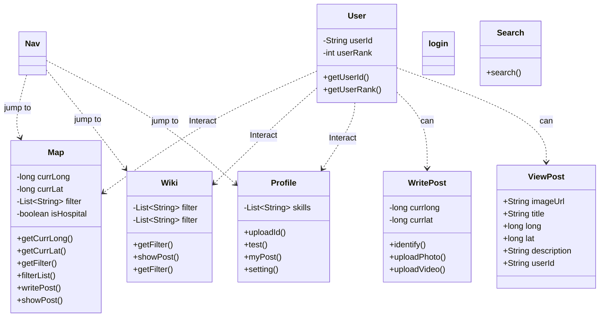

# Software Requirements Specification

## Purpose  

WildlifeER(WLER)’s main purpose is to provide a communication platform for general public to save more injured wildlife together. The application offers public individuals a chance to work together to bring more found injured animals to local hospitals and shelters by receiving and sharing animal information and hospital information through the app. The data over injured animals collected by the app through posts will be useful data for researchers, wildlife professionals, and local governments for future research and analysis. Lastly, the WildlifeER will provide comprehensive educational resources for users in order to facilitate the recue process and for long-term education among the public.  

### Definitions  

Wildlife: Native/non-native wild animals that cannot and should not be kept domestically.  

Wildlife hospitals/shelters: Organizations that receive certain types of injured wildlife to help them recover or euthanasia。 

Wildlife professionals: People who practice careers in the field of wildlife protection, research or relevant fields closely connected to wildlife. 

Department of Fish and Wildlife: Governmental officials that practice activities in wildlife protection, research, environmental protection and control, and other relevant fields.  

Volunteer: People recognized by any wildlife protection organization or WildlifeER for their volunteer skills and effort through learning and real-life practice.  

Status for wildlife posts: Each wildlife post should display a status indicating the various stages of the rescue process. The status is one of the three: the animal is being picked up, captured, and transported to a hospital.   

Volunteer Skill Evaluation: Volunteers with advanced skills and intend to assist with more restricted species should demonstrate their ability to handle animals requiring more advanced skills, such as raptors or baby bobcats, by providing proof of relevant training and experience.  

-  Beginner Volunteer: Their skills should include but not limited to basic animal care (feeding, cleaning enclosures), general wildlife observation and monitoring and basic first aid knowledge for minor injuries (cuts, scratches). 

- Intermediate Volunteer: Their skills should include but not limited to comfortable handling small, non-dangerous animals (e.g., birds, rabbits), participating in wildlife rescues under supervision, basic understanding of animal behavior and species identification and familiarity with common rehabilitation equipment. 

- Advanced Volunteer: Their skills should include but not limited to experience in handling larger or more dangerous animals (e.g., raptors, bobcats, snakes), knowledgeable in animal behavior, able to identify stress signals or aggressive postures, able to administer basic medical treatments and participation in wildlife rescue and rehabilitation independently or as team leads. 

- Expert Volunteer: Their skills should include but not limited to highly specialized in working with endangered species or highly dangerous wildlife, capable of rehabilitating injured wildlife from intake to release and skilled in educating the public or peers about wildlife conservation efforts. 

 

## Background 

Many injured wildlife is found every day around the states. People post pictures and videos about these injured animals showing empathy and sadness but do not know how to help them. Some don’t even know that these animals can be helped and cured.  Thus, WildlifeER is here to help share information and education resources among the public, volunteers, and wildlife hospitals to help cure and release more wildlife back into nature. Recognizing the key issue is that the public knows little about the power they can do in wildlife protection, WildlifeER intends to form a communication network that connects public individuals, volunteers and local wildlife organizations where people can post and search wildlife information within the app. Through posts, educational resources, and communication, various sides can form a chain to find, transport, and cure found injured wildlife.  

What’s more, data resources are always useful for wildlife professionals and researchers. Thus, WildlifeER will collect the data provided by our users through their posts and incorporate these data into useable databases for future research purposes of wildlife professionals.  

 

## Overall Description:  

### User Characteristics  

-  General Public 

People who are interested in helping wildlife regardless of their wildlife knowledge. Usually general public are not equipped with a lot of wildlife knowledge.  

Though any people may find an injured wildlife, because of the number of public members, usually they help find injured wildlife and bring them to local wildlife hospitals.  

-  Wildlife Volunteers 

Current recognized volunteers of a wildlife protection organization or WildlifeER. Volunteers are very interested in helping wildlife and are equipped with certain wildlife knowledge based on their experience. Volunteers’ skills may vary a lot due to their experience and training received. 

Volunteers can assist non-profit organizations to cure and rehabilitate injured wildlife based on their level of training and experience.  

-  Wildlife Professionals 

People practicing their career in the field of wildlife protection, research, or other relevant fields.  Equipped with high level of knowledge related to wildlife and relevant topics.  

Wildlife professionals are usually responsible for treating injured wildlife and practicing relevant research.   

-  Fish and Wildlife Department Officials 

People who are governmental officials that practice careers in protecting 		wildlife(usually large carnivores like bears and bobcats). Equipped with high 	   level of knowledge related to wildlife and relevant topics.   

Officials are responsible for capturing, transporting and treating large animals 	or endangered animals with local wildlife organizations.  

-  Visitors 

People who may have some to little interest in helping and learning about wildlife but may still want to access the app to checkout what it is about due to various reasons. This group are probably equipped with little to no knowledge of wildlife. 

### User Stories  

- As a public member, I want to share a post about an injured animal I found along with its current location, picture and videos, and my contact information. 

- As a volunteer and public member, I want to be able to see other injured wildlife needed to be transported to a local wildlife hospital.  

- As a volunteer and public member, I want to be able to pick up an injured animal I see on a post and bring it to a local hospital by being a recognized volunteer or passing a small quiz in WildlifeER. 

- As a public member or volunteer, I want to see information about local wildlife hospitals on a map along with information about their address, contact, and type of animal they take. 

- As a pubic member, I want to access more educational resources over local wildlife and wildlife protection.  

- As a wildlife professional or governmental official, I want to be able to download the up-to-date database over our local injured wildlife. 

- As a wildlife professional working at a shelter being included in this app, I want to be able to check if an animal is on their way to the shelter and status of other animals that need help 

- As a user, I want to be able to be identified as either a public, volunteer, wildlife professional, governmental official or visitor according to my skills and needs.   

## App workflow 

https://drive.google.com/file/d/1sXpsLHpMP4R6Ihl0tSHBYSMTZF2_CTID/view?usp=sharing 

 

## Requirement  

### Functional 

- User Registration: 

Users can create accounts with personal information and identification. 

Users can sign in and sign out of their accounts. 

Users need to sign the privacy agreement and terms of use before the first use. 

Users can verify their professional knowledge level with personal identification or by a built-in knowledge	quiz. 

- *Visitor Touring*: 

Users can log in as a visitor to tour WildlifeER with personal information required. 

Users will be restricted to their status as visitors and will not be able to access all content, such as the specific location of animals. 

- ## Posting: 

Users can create a post to share the wildlife’s locations, photos, short videos, and text descriptions. 

Users are able to edit the published posts. 

Users can use the built-in camera tools to get suggestions of the species of the wildlife. 

Users can filter all posts or hospitals based on species and location. 

Users can report posts for false information such as species, or user behavior issues. 

- ## Wildlife hospital: 

Users can obtain the contact information, address, and the scopes of rescuable animals of wildlife hospital in searching area. 

- ## Reporting

  Users can report invalid posts and behaviors that violate community standards such as keeping the animal to oneself. 

- ### Wildlife wikipedia: 

Users can obtain general knowledge of wildlife and tips for helping animals. 

Users can obtain a guideline for self help. 

- ### Educational supports: 

Users can download the species, posting, or location database for a certain purpose. 

- **Contacts**: 

The wildlife hospital can contact the authors of posting by their provided contact information. All the sensitive information will be hided to other public users and visitors 

$$$ Non-Functional  

- *Database*: 

Implement a database to store user profiles, location of animals, and posts. 

Implement a regular backup for database to prevent data loss. 

- **Secure Authentication**: 

Implement secure authentication for user login process and account data. 

- *Usability*:  

Implement user-friendly operation logic and UI for elderly people and individuals with disabilities. 

Implement a dark mode switch for improved visual comfort. 

Implement adjustable font sizes for users with visual impairments.  

Implement a notification push function for user to have up-to-date information. 

- Compatibility: 

WLER must be compact with both Android. 

- **Privacy**: 

WLER must comply with the pricy regulations. 

- Reliability 

The app and server should operate reliably without frequent crashes or downtime. 

The app should record the user's approximate location when the network signal or location signal is weak. 

## Gantt Diagram

## UML

